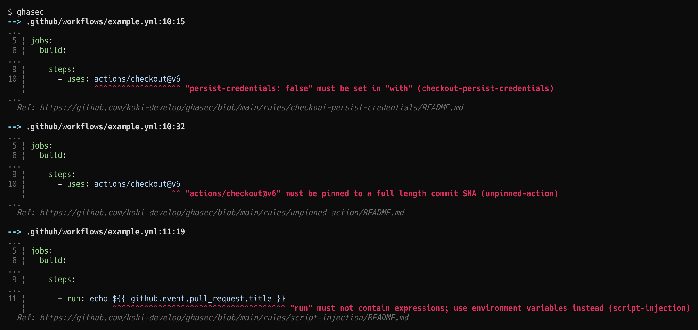

<h1 align="center">
ghasec
</h1>

<p align="center">
<a href="https://github.com/koki-develop/ghasec/releases/latest"></a>
<a href="https://github.com/koki-develop/ghasec/actions/workflows/ci.yml"></a>
<a href="https://goreportcard.com/report/github.com/koki-develop/ghasec"></a>
<a href="./LICENSE"></a>
</p>

<p align="center">
<i>
Catch security risks in your GitHub Actions workflows.
</i>
</p>

<p align="center">

</p>

## Installation

### Go

```console
$ go install github.com/koki-develop/ghasec@latest
```

### GitHub Releases

Download the binary for your platform from the [Releases](https://github.com/koki-develop/ghasec/releases/latest) page.

## Usage

```console
$ ghasec --help
Catch security risks in your GitHub Actions workflows.

Usage:
  ghasec [files...] [flags]

Flags:
  -h, --help       help for ghasec
      --no-color   disable colored output
      --online     enable rules that require network access
  -v, --version    version for ghasec
```

When run without arguments, ghasec automatically discovers `.github/workflows/*.yml|yaml` and `**/action.yml|yaml` files in the current directory.

```console
$ ghasec
```

You can also specify files explicitly:

```console
$ ghasec example.yml
```

### Ignoring Rules

Add a `# ghasec-ignore: <rule-name>` comment above the line to suppress a specific diagnostic:

```yaml
# ghasec-ignore: unpinned-action
- uses: actions/checkout@v6
```

Multiple rules can be separated by commas:

```yaml
# ghasec-ignore: unpinned-action, checkout-persist-credentials
- uses: actions/checkout@v6
```

Omit the rule name to suppress all diagnostics on the line:

```yaml
# ghasec-ignore
- uses: actions/checkout@v6
```

## Rules

See [Rules](./rules/README.md) for the full list of available rules.

## License

[MIT](./LICENSE)
